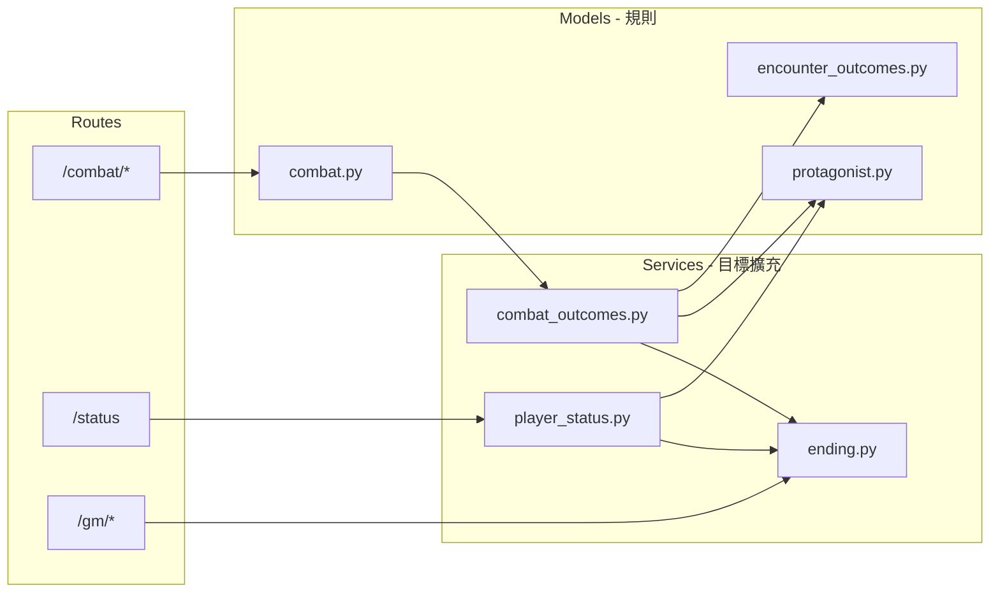

# Oikonomia — Architecture Roadmap

> **來源**：Grok 方向建議（2026-06-29）· **對照 commit**：`d1e47d4`  
> **讀者**：Grok（方向）、Grok Build（實作）、Gemini（review）、Tak（決策）  
> **營會約束**：~20 人、3 日 2 夜西貢戶外、PA 單機、穩定性 > 新功能

---

## 設計目標

| 目標 | 含義 |
|------|------|
| **一致性** | Protagonist / Trauma / Ending 以 DB 為 SSOT，`/status` 統一聚合 |
| **可維護性** | 結算編排在 Service 層；重大決策記本文 + Drive 備份 |
| **可靠性** | DB 鎖、前端 resolving poll、GM override + log |
| **神學整合** | Trauma 對應軟弱中得力；Ending 體現救贖／盼望（非純懲罰） |

---

## 現況評估（2026-06-29）

### 已有優勢 ✅

| 模組 | 現況 |
|------|------|
| **Combat** | `models/combat.py` 原子 resolving 鎖、`with_db_retry`；server dice；前端 phase lock + 1s poll（`d1e47d4`） |
| **Protagonist** | `protagonist_states` 表；stage≥3 或 JSON flag 玩家操控；AI fallback |
| **Trauma** | 瀕死 +1 `trauma_count`；>3 → `bad_ending`；`test_combat_flow` 有 regression |
| **Ending** | `teams.ending_type`；`get_team_ending_state()`；勝利時 `apply_trauma_bad_ending_victory` |
| **Outcome 事務** | `apply_encounter_success/failure` 已包 `immediate_transaction`（`d1e47d4`） |
| **Status** | `/status` 經 `build_player_status()` 回傳 `protagonists` + `ending` |

### 待改善 ⚠️

| 問題 | 現況 |
|------|------|
| **Ending 判斷分散** | `protagonist.py`、`combat.py` `_end_combat`、`encounter_outcomes.py` 各有一部分 |
| **Outcome 編排分散** | `_end_combat` 直接呼叫 success/failure/trauma_bad_ending，無單一 orchestrator |
| **Trauma 觸發單一** | 主要來自瀕死；encounter narrative 條件觸發未擴展 |
| **Good Ending** | 正面結局 narrative／演出待寫（AGENT_HANDOFF 已知待辦） |
| **GM override** | 可調 stat；trauma/ending 強制覆寫 + audit log 未完整 |
| **前端離線** | 無 offline queue（營會 Wi‑Fi 不穩時靠 polling 重試） |

---

## 目標架構（高層）

**原則**：Models 保留規則與 DB；Services 負責「戰鬥結束後做咩」的編排；Routes 薄層。

---

## 分階段計劃

### Phase 1 — 營會前可做（低風險，~2h）

| # | 任務 | 產出 | 風險 |
|---|------|------|------|
| 1.1 | **`services/ending.py`** | `judge_ending(team_id)` 整合 `check_ending_condition`、`teams.ending_type`、trauma 總數 | 低 |
| 1.2 | **`protagonist.apply_trauma(delta, reason)`** | 統一入口 + reason log（可先寫 combat log 或 DB 欄位） | 低 |
| 1.3 | **`/status` 強化** | 加 `trauma_level`、`ending_preview`（玩家可見摘要；GM 細節仍用 `/gm`） | 低 |
| 1.4 | **`_end_combat` 改呼叫** | 勝利後改經 `judge_ending` / 薄 wrapper，行為不變 | 低 |

**唔做（Phase 1）**：大規模搬移 `models/combat.py`、Event Bus、拆 `index.html`。

### Phase 2 — 營會後／下個版本（半天）

| # | 任務 | 產出 |
|---|------|------|
| 2.1 | **`services/combat_outcomes.py`** | `resolve_combat_outcome(winner, team_id, encounter)` 統一 success/failure/trauma/ending |
| 2.2 | **Protagonist 狀態機** | enum：`normal` / `near_death` / `traumatized` / `resolved`（文件 + helper） |
| 2.3 | **Narrative 條件片段** | `data/narrative_stories.py` 擴展 trauma/ending 觸發 |
| 2.4 | **拆 `app.py` migrations** | → `database.py`（Gemini 技術債） |

### Phase 3 — 長期

- Event bus（僅當 encounter 類型 >10 或多系統整合時）
- 前端 offline queue + 提交重試
- Good Ending 完整演出 + Salvio Boss encounter

---

## 方案比較（Grok 建議摘錄）

| 方案 | 複雜度 | 維護性 | 營會適用 | 建議 |
|------|--------|--------|----------|------|
| 現況（分散） | 低 | 中 | 中 | 已可上線；Phase 1 收斂 ending |
| **中央 Orchestrator** | 中 | 高 | **高** | **首選**（Phase 2） |
| 全 Event Bus | 高 | 最高 | 低（3 日營會） | 暫緩 |

---

## 風險與緩解

| 風險 | 緩解 |
|------|------|
| 併發／網路 | ✅ DB 鎖 + resolving 1s poll；可加 submit 指數退避 |
| GM 調整 | GM 調 stat 已有；待加 trauma/ending override + `gm_audit` log |
| Trauma 太懲罰 | 維持 >3 才 bad_ending；narrative 強調「軟弱中得力」 |
| Context 壓力 | 本文 + `AGENT_HANDOFF` + `CURRENT_STRUCTURE`；決策記下文 |

---

## 決策日誌

| 日期 | 決策 | 負責 |
|------|------|------|
| 2026-06-29 | 採 Grok 三分工：Grok 方向 / Grok Build 實作 / Gemini review | Tak |
| 2026-06-29 | 戰鬥模組標記 Production Ready（Gemini §15）；優先做 Phase 1 收斂 ending | Grok + Grok Build |
| 2026-06-29 | Phase 2 Orchestrator 延後至營會後；營會前不拆 `index.html` | Grok Build 建議 |
| 2026-06-29 | **Phase 1 完成**：`services/ending.py`、`apply_trauma(reason)`、`/status` trauma_level + ending_preview、`_end_combat` 經 `judge_ending` | Grok Build |
| 2026-06-29 | **Phase 2 完成**：`services/combat_outcomes.py`、`ProtagonistLifeState`、`CONDITIONAL_NARRATIVE_FRAGMENTS`、`database.py` 拆出 migrations | Grok Build |

---

## 相關文檔

| 文檔 | 用途 |
|------|------|
| `AGENT_HANDOFF.md` | Grok Build 實作交接 |
| `CURRENT_STRUCTURE.md` | 目錄快照 |
| `GEMINI_REVIEW.md` | Review 清單與對照表 |
| `README.md` | 三角色分工 |