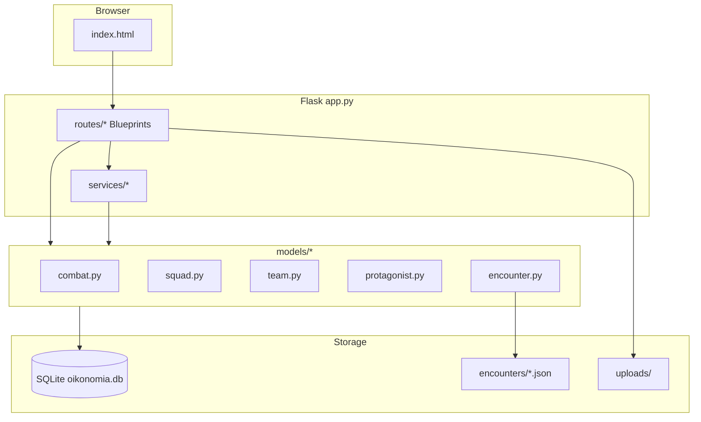

# Oikonomia — Current Structure

> 最後更新：2026-06-29 · Git：`fd4e0e1`（Phase 1 spec 補齊進行中）  
> 路徑：`/Users/mingtakyau/Documents/oikonomia`  
> 備份：`Google Drive/My Drive/oikonomia`

Summer Camp 2026 ARG Web App（Flask）。雙主角路線 Iggy / Marah，含玩家 Dashboard、遭遇戰、故事、GM 後台。

---

## 目錄總覽

```
oikonomia/
├── app.py                    # Flask 入口、configure_models、register blueprints (~440 行)
├── database.py               # DB bootstrap、migrate_db、safe_init_db
├── wsgi.py                   # PythonAnywhere WSGI 入口
├── requirements.txt
├── render.yaml               # Render.com 設定（如有）
├── oikonomia.db              # 本地預設 SQLite（開發用）
├── .deploy-version           # 已部署 commit 標記
├── .gitignore
│
├── README.md
├── AGENT_HANDOFF.md          # Agent 交接（架構、部署、測試）
├── GEMINI_REVIEW.md          # 外部 code review 紀錄
├── CURRENT_STRUCTURE.md      # 本檔：專案結構快照
├── ARCHITECTURE_ROADMAP.md   # Grok 方向 · Phase 1–3 計劃
├── decisions_log.md          # 重大架構決定（Drive SSOT）
│
├── models/                   # 資料層 & 核心業務邏輯
├── routes/                   # HTTP Blueprints（API + GM HTML）
├── services/                 # 跨 route 服務
├── utils/                    # 工具（上傳、QR、DB retry…）
├── data/                     # 靜態遊戲設定（locations、story）
│
├── templates/                # Jinja / 內嵌 HTML 模板
├── static/                   # 頭像、物品圖、主角肖像
├── encounters/               # Encounter JSON 定義
│
├── deploy/                   # PythonAnywhere 部署腳本
├── scripts/                  # 本地測試腳本
│
├── local_data/               # 本地 DATA_DIR 執行時資料（含 DB）
├── uploads/                  # 玩家上傳相片（不 commit）
├── venv/ / .venv/            # Python 虛擬環境（不 commit）
└── __pycache__/              # 編譯快取（不 commit）
```

---

## models/ — 資料 & 核心邏輯

| 檔案 | 職責 |
|------|------|
| `settings.py` | 全域設定（DB 路徑、常數、預設主角 stats） |
| `squad.py` | 玩家小隊：HP/max_hp、更新、隊伍成員 |
| `team.py` | 隊伍：建隊、加入、路線、主角資料聚合 |
| `protagonist.py` | Iggy/Marah 主角狀態、trauma、參戰、AI 行動 |
| `item.py` | 物品定義、QR 領取、能力效果 |
| `encounter.py` | 載入 `encounters/*.json`（含 cache） |
| `encounter_outcomes.py` | 勝敗獎勵、trauma、encounter logs |
| `combat.py` | 戰鬥核心：結算、預覽、狀態 API payload (~1470 行) |

---

## routes/ — HTTP 層

| 檔案 | 前綴 | 職責 |
|------|------|------|
| `auth.py` | `/` | 登入、PIN、session restore |
| `player.py` | `/` | `/status`、任務提交、頭像、顯示名 |
| `team.py` | `/team` | 建隊、加入、路線、隊名 |
| `combat.py` | `/combat` | 開始戰鬥、提交行動、狀態輪詢 |
| `encounters.py` | `/` | Encounter 列表、`/encounter_logs` |
| `items.py` | `/` | 物品、QR claim |
| `story.py` | `/` | 故事進度、劇情片段 |
| `misc.py` | `/` | 公告、全球事件、`/api/version`、上傳靜態 |
| `gm.py` | `/gm` | GM API（調整數值、隊伍、戰鬥監控） |
| `gm_templates.py` | — | GM Dashboard / 玩家詳情 HTML（~1686 行） |

玩家 UI 主體在 `templates/index.html`（~6372 行 JS/HTML），唔再寫喺 `app.py`。

---

## services/ — 共用服務

| 檔案 | 職責 |
|------|------|
| `player_status.py` | 組裝 `/status`（trauma_summary、ending_preview、protagonist_control_status） |
| `ending.py` | **Phase 1 orchestrator**：`judge_ending`、`apply_ending`、trauma band |
| `combat_outcomes.py` | 戰後編排：`resolve_combat_outcome` → success/failure/trauma/ending |
| `session_auth.py` | Session restore token |
| `story.py` | 故事階段、任務計數 |
| `narrative.py` | 劇情敘事輔助 |
| `teams_overview.py` | GM 隊伍總覽、戰鬥快照 |
| `global_events.py` | 全營事件（sanity/power 等） |
| `announcements.py` | 公告 CRUD |
| `gm_auth.py` | GM PIN 登入、8 小時 session |
| `gm_admin.py` | GM 管理操作 |

---

## utils/

| 檔案 | 職責 |
|------|------|
| `helpers.py` | 隊伍 ID 正規化、stat clamp、檔名安全 |
| `uploads.py` | 影相驗證（PIL）、儲存路徑 |
| `qr.py` | 簽名 QR v2、legacy 開關 |
| `db_tx.py` | `immediate_transaction`、`with_db_retry` |
| `validators.py` | 輸入驗證、status effects 解析 |
| `env.py` | `DATA_DIR`、環境變數 |
| `deploy.py` | 部署輔助 |
| `app_state.py` | 應用狀態 |
| `tasks.py` | 背景任務相關 |

---

## data/ — 靜態遊戲資料

| 檔案 | 內容 |
|------|------|
| `locations.py` | GPS 探索地點 |
| `story_config.py` | 故事階段門檻 |
| `narrative_stories.py` | 劇情片段定義 |
| `oikonomia.db` | `DATA_DIR=data/` 時嘅執行 DB 副本 |

---

## encounters/ — 遭遇戰 JSON

| 檔案 | 用途 |
|------|------|
| `enc_iggy_01_leech.json` | Iggy 線 · 情緒寄生影 |
| `enc_iggy_02_boundary.json` | Iggy 線 · 界線 |
| `enc_marah_01_whisper.json` | Marah 線 |
| `test_combat_01.json` | 開發測試戰鬥 |
| `test_protagonist_control.json` | 主角玩家操控測試 |
| `test_hard_win_item.json` | 難勝 + 物品測試 |
| `test_lose_trauma.json` | 落敗 trauma 測試 |
| `test_undefeatable.json` | 打不贏測試 |
| `cache_test.json` | Encounter cache 測試用 |

---

## static/

```
static/
├── avatars/          # 玩家可選頭像（png/jpg）
├── portraits/        # Iggy/Marah 主角肖像（6 張）
└── images/
    ├── default-item.svg
    ├── enemies/      # 敵人 SVG
    └── items/        # 物品 item-001 ~ item-005
```

---

## templates/

| 檔案 | 用途 |
|------|------|
| `index.html` | 玩家主 UI（Dashboard、戰鬥、隊伍、日誌、故事） |
| `claim_item.html` | QR 領取物品頁 |

GM 介面 HTML 內嵌於 `routes/gm_templates.py`（`GM_DASHBOARD_HTML` 等）。

---

## deploy/ — PythonAnywhere

| 腳本 | 用途 |
|------|------|
| `pa-update.sh` | 標準部署：`git pull`、venv、`pip install`、wsgi smoke test |
| `pa-diagnose.sh` | Git / 路徑診斷 |
| `pa-check-error.sh` | WSGI import、DB 錯誤檢查 |
| `pa-ensure-secret.sh` | `data/.secret_key` |
| `pa-wsgi-web-tab.py` | Web tab WSGI 範例 |

正式環境：https://takjai.pythonanywhere.com  
GM：`/gm`（PIN：`gm2026` 或 env `GM_PIN`）

---

## scripts/ — 測試

| 腳本 | 用途 |
|------|------|
| `test_combat_flow.py` | 戰鬥全流程（Team + Iggy encounter） |
| `test_encounter_cache.py` | Encounter 快取失效 |
| `test_combat_concurrency.py` | 併發結算 smoke test |
| `test_ending_flow.py` | Phase 1 ending orchestrator regression |

```bash
./venv/bin/python3 scripts/test_combat_flow.py
./venv/bin/python3 scripts/test_ending_flow.py
```

---

## 執行時資料路徑

| 環境 | `DATA_DIR` | 資料庫 |
|------|------------|--------|
| 本地開發 | 預設專案根目錄 | `./oikonomia.db` |
| 本地（`DATA_DIR`） | `./local_data/` | `local_data/oikonomia.db` |
| PythonAnywhere | `data/` | `data/oikonomia.db` |
| 上傳目錄 | — | `uploads/`（Flask serve，唔 map static） |

---

## 架構關係（簡圖）



---

## 相關文件

- 開發交接、部署流程 → `AGENT_HANDOFF.md`
- 功能說明、本地運行 → `README.md`
- Code review 紀錄 → `GEMINI_REVIEW.md`