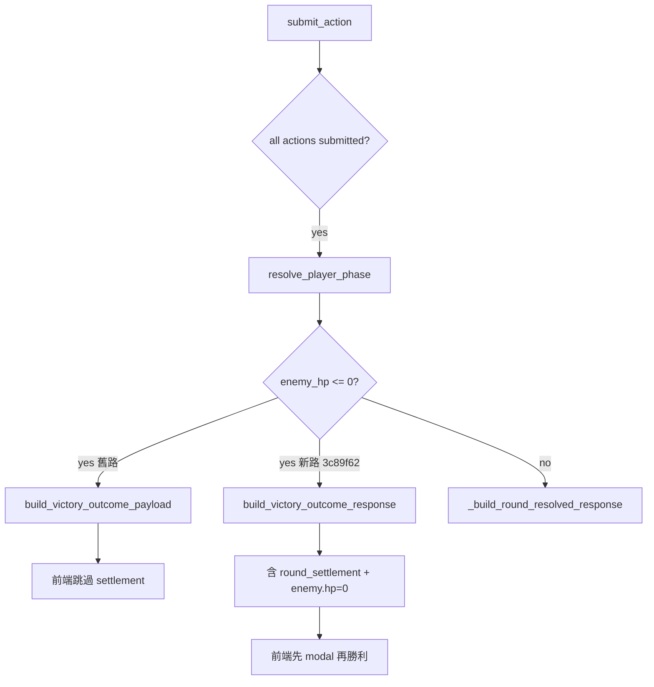

# BUG-2026-001：戰鬥敵人 HP 唔跌／結算 modal 缺失

| 欄位 | 值 |
|------|-----|
| **狀態** | resolved（待 Henry 實機確認） |
| **嚴重度** | High（玩家以為打唔入／遊戲壞咗） |
| **影響** | 單人 + 主角、低 HP 練習戰、一輪擊殺 |
| **修復 commit** | `3c89f62`（方案1）；前期 `4bbb885`、`e2e6dc7` |
| **決策記錄** | `decisions_log.md` § 2026-06-29 Combat Killing Blow |

---

## 1. 摘要

玩家（Saliba、Henry 等）打遭遇戰時，**有時見到傷害數字，但敵人 HP 條／數字唔跌**，或**冇完整「本回合戰果」modal**。後端 DB `enemy_hp` 多數正確；問題集中喺 **一輪擊殺（killing blow）時 API 只返極簡 victory JSON**，前端直接跳勝利畫面，跳過 `syncEnemyHpDisplay` 同 settlement UI。48 HP 練習敵「速戰殘影」+ Iggy 主角自動 Zoo 最易觸發。

---

## 2. 症狀

| 回報者 | Encounter | 具體表現 |
|--------|-----------|----------|
| Saliba | `enc_iggy_01_leech`（情緒寄生影） | 有時有結算、有時冇；傷害數字有但 HP 唔跌 |
| Henry | `practice_iggy_01_quick`（速戰殘影，48 HP） | 更新至 `e2e6dc7` 後仍類似；常第一擊就贏 |
| Henry | `practice_iggy_03_boundary`（140 HP） | 每回合 -4 左右，血條幾乎唔郁（UX 似 bug） |

**共同點**：F5 未必救到；polling 期間 UI 可能被舊 snapshot 覆寫。

---

## 3. 根因（已驗證）

### 3.1 主根因：killing blow victory 捷徑

```
submit_action → resolve_player_phase → enemy_hp <= 0
  → routes/combat.py: winner == "squad"
  → return build_victory_outcome_payload()   # 極簡，無 settlement
  → 前端 submitAction: if (data.outcome) finishCombatVictoryFromPayload()
  → 跳過 showFullRoundSettlement() + syncEnemyHpDisplay()
```

`services/combat_outcomes.py` 嘅 `build_victory_outcome_payload` 只有 narrative / reflection，**無** `round_settlement`、`log_entries`、`enemy.hp`。

### 3.2 次要因素

| 因素 | 說明 |
|------|------|
| 主角自動 Zoo | `choose_protagonist_auto_action` + power 100 → 傷害遠大於玩家，易一輪秒殺 |
| 前端 poll | `loadCombatStatus` 喺 settlement 期間可能覆寫 HP（已用 flag 緩解） |
| 一輪勝利 log 遺失 | `_end_combat` 前未 `save_combat(logs=…)`（`e2e6dc7` 已修） |
| 測試缺口 | CI 多數多回合或雙人隊；未覆蓋「單人 + 48 HP + 主角一輪勝利 + API 必須有 settlement」 |

### 3.3 決策流程（Mermaid）



---

## 4. 做過咩（按 commit）

| Commit | 內容 | 效果 |
|--------|------|------|
| `a106380` | settlement 期間 lock actions | 減少 double-submit |
| `987b3af` | enemy HP ≤ 0 結束戰鬥 | DB 正確 |
| `eae8366` | settlement modal 顯示敵 HP | 多回合 case 改善 |
| `14bd58e` | poll 跳過 settlement；log HP | 減 poll 覆寫 |
| `60408b2` | `reconcile_enemy_hp`；dice preview 保護 | 修 stale HP |
| `4bbb885` | `syncEnemyHpDisplay`；`enemy_hp_after` | round_resolved 路徑改善 |
| `25288bc` | 6 個 practice encounter | 方便重現測試 |
| `e2e6dc7` | CI + deploy gate；一輪勝利 save logs | 測試全綠但 killing blow payload 仍缺 |
| **`3c89f62`** | **`build_victory_outcome_response`；前端先 settlement 再勝利** | **針對主根因** |

---

## 5. 困難／誤判

1. **以為純 frontend bug** — DB 其實 often 正確；花大量時間改 poll／動畫，killing blow 仍漏。
2. **CI 全綠 = 冇事** — `test_solo_killing_blow` 用雙人隊 + 手動 `enemy_hp=1`，唔等同 Henry 單人 + 48 HP + 主角 Zoo。
3. **`hp or -1` falsy** — `enemy_hp=0` 喺 Python/JS 測試斷言曾誤判（與本 bug 無關但拖慢審計）。
4. **context window** — `combat.py` ~1500 行 + `index.html` ~6200 行；需分段 attachments + Drive case（Grok Architect 建議）。

---

## 6. 最終修復（方案1）

### 後端

- 新增 `models/combat.py` → `build_victory_outcome_response()`
- `routes/combat.py`：`winner == "squad"` 時 merge round_resolved + victory meta
- `combat_outcome_if_finished` 同 `/combat/status` ended 路徑一併 enriched

### 前端

- `finishCombatVictoryFromPayload`：若有 `round_settlement`，先 `showFullRoundSettlement`，按「確認戰果，查看勝利」再出勝利 modal

### 測試

- `test_solo_killing_blow_practice_quick`（單人 + `practice_iggy_01_quick`）
- killing blow 雙人 test assert `round_settlement` 存在
- `scripts/pre_deploy_checks.sh` 154+ 項

---

## 7. 實機 checklist（Henry）

- [ ] PA deploy `3c89f62` + Web Reload + 硬刷新
- [ ] `curl /api/version` → `version: 3c89f62`
- [ ] 【練習】速戰情緒殘影：第一擊贏
- [ ] 見 HP 跌到 0 + 「本回合戰果」modal
- [ ] 勝利 narrative + reflection
- [ ] F5 後無 zombie combat

---

## 8. attachments 清單

本 case `attachments/` 快照（調查時版本；以 GitHub `3c89f62` 為準）：

| 檔案 | 重點 |
|------|------|
| `templates/index.html` | `syncEnemyHpDisplay`、`finishCombatVictoryFromPayload` |
| `routes/combat.py` | `submit_action` victory 分支 |
| `models/combat.py` | `build_victory_outcome_response` |
| `services/combat_outcomes.py` | 舊版極簡 victory payload（對照用） |
| `encounters/practice_iggy_01_quick.json` | 48 HP 速戰殘影 |
| `scripts/test_combat_flow.py` | `test_solo_killing_blow_practice_quick` |
| `PROMPT.md` | 俾 Grok/Gemini 協作用 prompt |

---

## 9. 相關文檔

- `decisions_log.md` — 方案1 決策
- `UPDATE_LOG.md` — 可補短條目「killing blow settlement」
- Desktop `For Gemini and Grok/` — 2026-06-29 附件包
- Gemini Architect 分析 — killing blow payload 假設（2026-06-29 chat）

---

*最後更新：2026-06-29 · Grok Build*