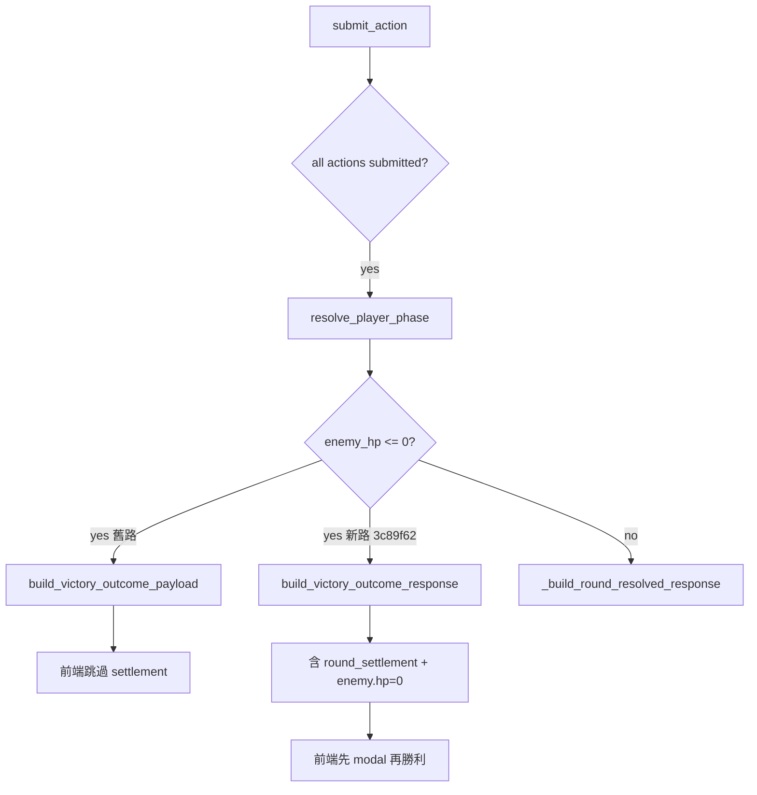

# BUG-2026-001：戰鬥敵人 HP 唔跌／結算 modal 缺失

| 欄位 | 值 |
|------|-----|
| **狀態** | **fix_in_progress** — 統一勝利入口（poll `outcome` 捷徑） |
| **嚴重度** | High（玩家以為打唔入／遊戲壞咗） |
| **影響** | 單人 + 主角、低 HP 練習戰、一輪擊殺；可能亦影響多回合 + polling |
| **修復 commit** | `0247f9c`（第二輪 UI）；`3c89f62` 方案1 **實機未通過** |
| **PA 實測 version** | **`3c89f62` 仍上線**（2026-06-29 晚 curl）；`0247f9c` **未 deploy／未 Web Reload** |
| **決策記錄** | `decisions_log.md` § 2026-06-29 Combat Killing Blow |

---

## 1. 摘要

玩家（Saliba、Henry 等）打遭遇戰時，**有時見到傷害數字，但敵人 HP 條／數字唔跌**，或**冇完整「本回合戰果」modal**。後端 DB `enemy_hp` 多數正確；問題集中喺 **一輪擊殺（killing blow）時 API 只返極簡 victory JSON**，前端直接跳勝利畫面，跳過 `syncEnemyHpDisplay` 同 settlement UI。48 HP 練習敵「速戰殘影」+ Iggy 主角自動 Zoo 最易觸發。

---

## 2. 症狀

| 回報者 | Encounter | 具體表現 |
|--------|-----------|----------|
| Saliba | `enc_iggy_01_leech`（情緒寄生影） | 有時有結算、有時冇；傷害數字有但 HP 唔跌 |
| Henry | `practice_iggy_01_quick`（速戰殘影，48 HP） | 更新至 `e2e6dc7` 後仍類似；常第一擊就贏 |
| Henry | `practice_iggy_03_boundary`（140 HP） | 每回合 -4 左右，血條幾乎唔郁（UX 似 bug） |

**共同點**：F5 未必救到；polling 期間 UI 可能被舊 snapshot 覆寫。

---

## 3. 根因（已驗證）

### 3.1 主根因：killing blow victory 捷徑

```
submit_action → resolve_player_phase → enemy_hp <= 0
  → routes/combat.py: winner == "squad"
  → return build_victory_outcome_payload()   # 極簡，無 settlement
  → 前端 submitAction: if (data.outcome) finishCombatVictoryFromPayload()
  → 跳過 showFullRoundSettlement() + syncEnemyHpDisplay()
```

`services/combat_outcomes.py` 嘅 `build_victory_outcome_payload` 只有 narrative / reflection，**無** `round_settlement`、`log_entries`、`enemy.hp`。

### 3.2 次要因素

| 因素 | 說明 |
|------|------|
| 主角自動 Zoo | `choose_protagonist_auto_action` + power 100 → 傷害遠大於玩家，易一輪秒殺 |
| 前端 poll | `loadCombatStatus` 喺 settlement 期間可能覆寫 HP（已用 flag 緩解） |
| 一輪勝利 log 遺失 | `_end_combat` 前未 `save_combat(logs=…)`（`e2e6dc7` 已修） |
| 測試缺口 | CI 多數多回合或雙人隊；未覆蓋「單人 + 48 HP + 主角一輪勝利 + API 必須有 settlement」 |

### 3.3 決策流程（Mermaid）



---

## 4. 做過咩（按 commit）

| Commit | 內容 | 效果 |
|--------|------|------|
| `a106380` | settlement 期間 lock actions | 減少 double-submit |
| `987b3af` | enemy HP ≤ 0 結束戰鬥 | DB 正確 |
| `eae8366` | settlement modal 顯示敵 HP | 多回合 case 改善 |
| `14bd58e` | poll 跳過 settlement；log HP | 減 poll 覆寫 |
| `60408b2` | `reconcile_enemy_hp`；dice preview 保護 | 修 stale HP |
| `4bbb885` | `syncEnemyHpDisplay`；`enemy_hp_after` | round_resolved 路徑改善 |
| `25288bc` | 6 個 practice encounter | 方便重現測試 |
| `e2e6dc7` | CI + deploy gate；一輪勝利 save logs | 測試全綠但 killing blow payload 仍缺 |
| **`3c89f62`** | **`build_victory_outcome_response`；前端先 settlement 再勝利** | **針對主根因** |

---

## 5. 困難／誤判

1. **以為純 frontend bug** — DB 其實 often 正確；花大量時間改 poll／動畫，killing blow 仍漏。
2. **CI 全綠 = 冇事** — `test_solo_killing_blow` 用雙人隊 + 手動 `enemy_hp=1`，唔等同 Henry 單人 + 48 HP + 主角 Zoo。
3. **`hp or -1` falsy** — `enemy_hp=0` 喺 Python/JS 測試斷言曾誤判（與本 bug 無關但拖慢審計）。
4. **context window** — `combat.py` ~1500 行 + `index.html` ~6200 行；需分段 attachments + Drive case（Grok Architect 建議）。

---

## 6. 最終修復（方案1）

### 後端

- 新增 `models/combat.py` → `build_victory_outcome_response()`
- `routes/combat.py`：`winner == "squad"` 時 merge round_resolved + victory meta
- `combat_outcome_if_finished` 同 `/combat/status` ended 路徑一併 enriched

### 前端

- `finishCombatVictoryFromPayload`：若有 `round_settlement`，先 `showFullRoundSettlement`，按「確認戰果，查看勝利」再出勝利 modal

### 測試

- `test_solo_killing_blow_practice_quick`（單人 + `practice_iggy_01_quick`）
- killing blow 雙人 test assert `round_settlement` 存在
- `scripts/pre_deploy_checks.sh` 154+ 項

---

## 7. 實機 checklist（Henry）

- [x] PA deploy `3c89f62` + Web Reload（`curl` 已確認 version）
- [x] `curl /api/version` → `version: 3c89f62`，`enemy_hp_sync_v2: true`
- [ ] 【練習】速戰情緒殘影：第一擊贏 — **用戶仍見 HP／結算異常**
- [ ] 見 HP 跌到 0 + 「本回合戰果」modal
- [ ] 勝利 narrative + reflection
- [ ] F5 後無 zombie combat

---

## 10. 方案1 部署後仍失敗（2026-06-29 更新）

**用戶回報**：更新後 Henry 打速戰殘影等練習戰，**問題仍然存在**。

**已排除**：

| 假設 | 證據 |
|------|------|
| PA 未 deploy 新 code | `curl https://takjai.pythonanywhere.com/api/version` → `3c89f62` |
| CI 未跑 | `pre_deploy_checks.sh` 154 項全綠 |
| killing blow 無 settlement（API） | 本地 `test_solo_killing_blow_practice_quick` 通過 |

**結論**：`3c89f62` 修咗 **submit_action 直接勝利** 一條路，但**不足以覆蓋實機全部路徑**。主根因可能係 **多條前端入口**，唔止 killing blow payload。

### 10.1 新一輪首要懷疑（待驗證）

| 優先 | 懷疑路徑 | 說明 |
|------|----------|------|
| P0 | **`loadCombatStatus` poll 見 `outcome` 即 `showCombatResult`** | `templates/index.html` ~L3484：`if (data.outcome) { showCombatResult(data); return; }` — **完全跳過** `finishCombatVictoryFromPayload` 同 settlement modal。戶外 Wi‑Fi 慢時，poll 可能比 submit 回應先返，或結算後 poll 搶先顯示勝利。 |
| P0 | **多回合（非 killing blow）HP 同步** | `practice_iggy_03_boundary`（140 HP）每回合 -4，血條幾乎唔郁；`round_resolved` 路徑 poll 仍可能覆寫 `syncEnemyHpDisplay`。 |
| P1 | **手機瀏覽器快取舊 JS** | `/api/version` 新但 `index.html` 被 aggressive cache（需 hard refresh／無痕驗證） |
| P1 | **雙人隊 `waiting_for_teammates`** | Henry 若二人隊，第一擊只 preview／等待，體感似「冇結算」 |
| P2 | **擲骰 preview 與提交時序** | `combatPreviewPending` 期間 poll／modal 互斥仍可能有漏 case |
| P2 | **`shouldShowRoundSettlement` phase 條件** | `phase < 1` return false；邊界 case 可能唔出 modal |

### 10.2 建議下一輪修復方向（未實作）

1. **統一勝利入口**：`loadCombatStatus` 見 `outcome` 時改 call `finishCombatVictoryFromPayload(data)`，唔好直接 `showCombatResult`。
2. **poll 期間唔用 stale `enemy.hp`**：`combatAwaitingSettlementAck` 時拒絕 `updateCombatUI` 改敵 HP。
3. **實機採證**：請 Henry 提供 encounter 名、單人/雙人、有冇見 settlement modal、Safari 開發者遠端 console（如有）。
4. **新增測試**：模擬「poll 先返 outcome」順序嘅前端 integration 或 API contract test。

### 10.3 Henry 實機重現（2026-06-29 晚 — 用戶確認）

| 項目 | 內容 |
|------|------|
| 隊伍 | **單人** |
| 部署 | 用戶已跑 `FORCE=1 bash ~/oikonomia/deploy/pa-update.sh` |
| 結算 modal | **從未見過**「本回合戰果」 |
| 體感 | **打咗幾回合**，敵人 HP **完全唔似有扣** |
| 後端模擬 | 單人多回合 `practice_iggy_03_boundary`：API `enemy.hp` 每回合 -4，DB 正確；**問題在 frontend 顯示** |

### 10.4 第二輪修復方向（`fix(combat-ui)` 進行中）

1. **`resolveAuthoritativeEnemyHp`**：多來源取 `Math.min`，避免 stale `round_settlement.enemy_hp_after` 蓋過正確 `enemy.hp`
2. **`updateCombatUI`**：一律先 `applySettlementEnemyHp`
3. **`loadCombatStatus`**：`outcome` 改走 `finishCombatVictoryFromPayload`（唔再直接 `showCombatResult`）
4. **`handleCombatRoundResolved`**：`round_resolved` 有傷害時強制出 settlement modal
5. **測試**：`test_solo_multi_round_poll_hp_monotonic`

### 10.5 時間線

| 時間 | 事件 |
|------|------|
| 2026-06-29 AM | Saliba / Henry 初次回報；多輪 frontend + backend 修復 |
| 2026-06-29 PM | Architect 確認方案1；Grok Build 實作 `3c89f62` |
| 2026-06-29 PM | PA `3c89f62` deploy；curl 確認 |
| 2026-06-29 PM | 用戶：問題仍然存在 → case **reopened** |
| 2026-06-29 晚 | Henry：**單人、多回合、無 modal、HP 唔跌** → 第二輪 UI 修復 `0247f9c` |
| 2026-06-29 晚 | curl PA 仍 `3c89f62`：用戶 deploy 可能早於 push，或漏 **Web Reload** |

### 10.6 部署檢查（Henry 必做）

1. PA Bash：`FORCE=1 bash ~/oikonomia/deploy/pa-update.sh`（等腳本顯示 commit **`0247f9c` 或更新**）
2. **Web tab → Reload**（唔做呢步 workers 仍跑舊 code）
3. 手機 Safari：**硬刷新**或清網站資料
4. 驗證：`curl -s https://takjai.pythonanywhere.com/api/version` → `version` 新 commit + `markers.enemy_hp_sync_v3: true`

---

## 11. 全面閱讀後最終診斷（2026-06-29 晚）

**已讀取範圍**：bug_log attachments 入面完整 `index.html`（349971 bytes）所有 combat victory / polling / settlement 相關片段（`loadCombatStatus`、`submitAction`、`updateCombatUI`、`showCombatResult`、`finishCombatVictoryFromPayload` 呼叫點等）。

**最終根因**：
Frontend 有多條獨立勝利捷徑，只有 `submitAction` 同部分 `roundResolved` 分支會經過 `finishCombatVictoryFromPayload`。主要 poll 入口（`loadCombatStatus` `if (data.outcome)`）直接跳 `showCombatResult`，導致即使後端 payload 已經有 `round_settlement` + `enemy.hp=0`，玩家仍然見唔到 HP 條跌同 settlement modal。

**精準修改位置**：
- `loadCombatStatus` ≈L3484 `if (data.outcome)` 區塊
- `updateCombatUI` ≈L3318 非 live 狀態 outcome 處理
- 確保 `finishCombatVictoryFromPayload` 內部正確處理 `round_settlement`

**下一步**：執行統一勝利入口改動（見 Grok Build patch）。

### 11.1 Henry 實機 — HP 0 但戰鬥未結束（界線共生影）

| 項目 | 內容 |
|------|------|
| Encounter | `practice_iggy_03_boundary`（練習・界線共生影） |
| 症狀 | 敵 HP 顯示 **0**，但戰鬥仍 **`player_phase` active** |
| 根因 | ① `reconcile_enemy_hp` 從 log 將 `enemy.hp` 顯示為 0，但 `/combat/status` poll **唔 call** `combat_outcome_if_finished`；② 前端 poll 見 `hp<=0` 唔觸發 `finishCombatVictoryFromPayload`；③ `victoryPayloadHasSettlement` 誤將每次 poll 嘅 `round_settlement` 當要出 modal |
| 修復 | 後端 status zombie guard + 前端 poll `shouldFinishCombatVictory` + 收窄 settlement 判斷 |

---

## 8. attachments 清單

本 case `attachments/` 快照（調查時版本；以 GitHub `3c89f62` 為準）：

| 檔案 | 重點 |
|------|------|
| `templates/index.html` | `syncEnemyHpDisplay`、`finishCombatVictoryFromPayload` |
| `routes/combat.py` | `submit_action` victory 分支 |
| `models/combat.py` | `build_victory_outcome_response` |
| `services/combat_outcomes.py` | 舊版極簡 victory payload（對照用） |
| `encounters/practice_iggy_01_quick.json` | 48 HP 速戰殘影 |
| `scripts/test_combat_flow.py` | `test_solo_killing_blow_practice_quick` |
| `PROMPT.md` | 俾 Grok/Gemini 協作用 prompt |

---

## 9. 相關文檔

- `decisions_log.md` — 方案1 決策
- `UPDATE_LOG.md` — 可補短條目「killing blow settlement」
- Desktop `For Gemini and Grok/` — 2026-06-29 附件包
- Gemini Architect 分析 — killing blow payload 假設（2026-06-29 chat）

---

*最後更新：2026-06-29 晚 · Grok Build · 統一勝利入口 patch 已實作*