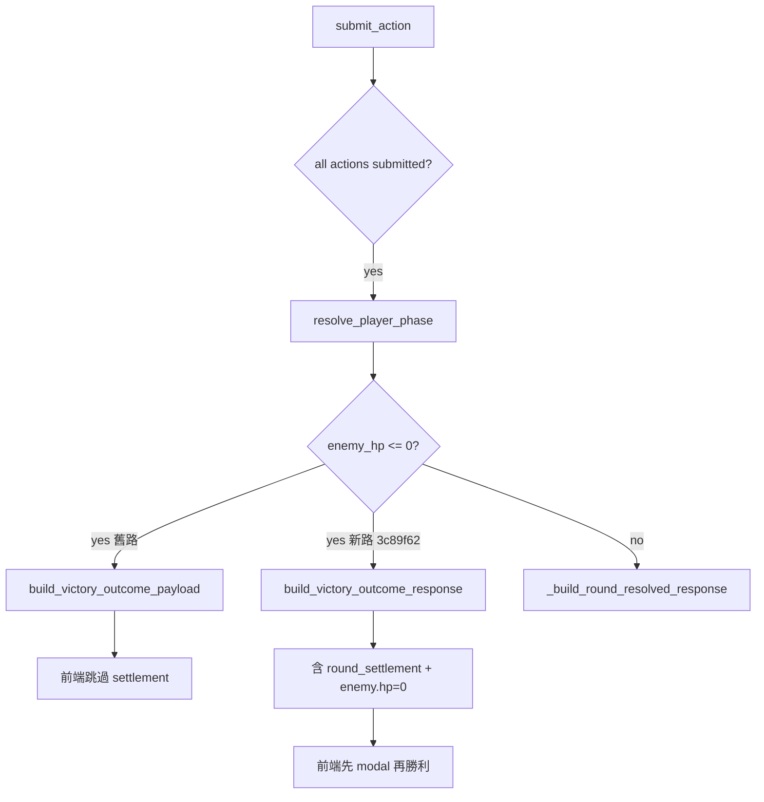

# BUG-2026-001：戰鬥敵人 HP 唔跌／結算 modal 缺失

| 欄位 | 值 |
|------|-----|
| **狀態** | **resolved** — Henry 實機 checklist 全通過（2026-06-30） |
| **嚴重度** | High（玩家以為打唔入／遊戲壞咗） |
| **影響** | 單人 Iggy 線、練習/主線遭遇戰、多回合 polling；雙人未充分驗證 |
| **修復 commit** | `3c89f62`→`12e1edd`（含 `combat_flow_v2`–`v7`、`settlement_breakdown_v1`、`enemy_hp_sync_v7`） |
| **PA 實測 version** | **`12e1edd`**；`combat_flow_v7: true`、`settlement_breakdown_v1: true`、`enemy_hp_sync_v7: true` |
| **決策記錄** | `decisions_log.md` § Combat Flow v2–v7 · § instant settlement · § Henry resolved |

---

## 1. 摘要

玩家（Saliba、Henry 等）打遭遇戰時，**有時見到傷害數字，但敵人 HP 條／數字唔跌**，或**冇完整「本回合戰果」modal**。後端 DB `enemy_hp` 多數正確；問題集中喺 **一輪擊殺（killing blow）時 API 只返極簡 victory JSON**，前端直接跳勝利畫面，跳過 `syncEnemyHpDisplay` 同 settlement UI。48 HP 練習敵「速戰殘影」+ Iggy 主角自動 Zoo 最易觸發。

---

## 2. 症狀

| 回報者 | Encounter | 具體表現 |
|--------|-----------|----------|
| Saliba | `enc_iggy_01_leech`（情緒寄生影） | 有時有結算、有時冇；傷害數字有但 HP 唔跌 |
| Henry | `practice_iggy_01_quick`（速戰殘影，48 HP） | 更新至 `e2e6dc7` 後仍類似；常第一擊就贏 |
| Henry | `practice_iggy_03_boundary`（140 HP） | 每回合 -4 左右，血條幾乎唔郁（UX 似 bug） |
| Henry | `practice_iggy_03_boundary`（2026-06-29 深夜） | **Iggy 線、單人、PA `641da28`**：開局 HP 或許正常，**戰鬥中血量顯示仍唔更新** |

**共同點**：F5 未必救到；polling 期間 UI 可能被舊 snapshot 覆寫。

---

## 3. 根因（已驗證）

### 3.1 主根因：killing blow victory 捷徑

```
submit_action → resolve_player_phase → enemy_hp <= 0
  → routes/combat.py: winner == "squad"
  → return build_victory_outcome_payload()   # 極簡，無 settlement
  → 前端 submitAction: if (data.outcome) finishCombatVictoryFromPayload()
  → 跳過 showFullRoundSettlement() + syncEnemyHpDisplay()
```

`services/combat_outcomes.py` 嘅 `build_victory_outcome_payload` 只有 narrative / reflection，**無** `round_settlement`、`log_entries`、`enemy.hp`。

### 3.2 次要因素

| 因素 | 說明 |
|------|------|
| 主角自動 Zoo | `choose_protagonist_auto_action` + power 100 → 傷害遠大於玩家，易一輪秒殺 |
| 前端 poll | `loadCombatStatus` 喺 settlement 期間可能覆寫 HP（已用 flag 緩解） |
| 一輪勝利 log 遺失 | `_end_combat` 前未 `save_combat(logs=…)`（`e2e6dc7` 已修） |
| 測試缺口 | CI 多數多回合或雙人隊；未覆蓋「單人 + 48 HP + 主角一輪勝利 + API 必須有 settlement」 |

### 3.3 決策流程（Mermaid）



---

## 4. 做過咩（按 commit）

| Commit | 內容 | 效果 |
|--------|------|------|
| `a106380` | settlement 期間 lock actions | 減少 double-submit |
| `987b3af` | enemy HP ≤ 0 結束戰鬥 | DB 正確 |
| `eae8366` | settlement modal 顯示敵 HP | 多回合 case 改善 |
| `14bd58e` | poll 跳過 settlement；log HP | 減 poll 覆寫 |
| `60408b2` | `reconcile_enemy_hp`；dice preview 保護 | 修 stale HP |
| `4bbb885` | `syncEnemyHpDisplay`；`enemy_hp_after` | round_resolved 路徑改善 |
| `25288bc` | 6 個 practice encounter | 方便重現測試 |
| `e2e6dc7` | CI + deploy gate；一輪勝利 save logs | 測試全綠但 killing blow payload 仍缺 |
| **`3c89f62`** | **`build_victory_outcome_response`；前端先 settlement 再勝利** | **針對主根因** |

---

## 5. 困難／誤判

1. **以為純 frontend bug** — DB 其實 often 正確；花大量時間改 poll／動畫，killing blow 仍漏。
2. **CI 全綠 = 冇事** — `test_solo_killing_blow` 用雙人隊 + 手動 `enemy_hp=1`，唔等同 Henry 單人 + 48 HP + 主角 Zoo。
3. **`hp or -1` falsy** — `enemy_hp=0` 喺 Python/JS 測試斷言曾誤判（與本 bug 無關但拖慢審計）。
4. **context window** — `combat.py` ~1500 行 + `index.html` ~6200 行；需分段 attachments + Drive case（Grok Architect 建議）。

---

## 6. 最終修復（方案1）

### 後端

- 新增 `models/combat.py` → `build_victory_outcome_response()`
- `routes/combat.py`：`winner == "squad"` 時 merge round_resolved + victory meta
- `combat_outcome_if_finished` 同 `/combat/status` ended 路徑一併 enriched

### 前端

- `finishCombatVictoryFromPayload`：若有 `round_settlement`，先 `showFullRoundSettlement`，按「確認戰果，查看勝利」再出勝利 modal

### 測試

- `test_solo_killing_blow_practice_quick`（單人 + `practice_iggy_01_quick`）
- killing blow 雙人 test assert `round_settlement` 存在
- `scripts/pre_deploy_checks.sh` 154+ 項

---

## 7. 實機 checklist（Henry）

- [x] PA deploy `3c89f62` + Web Reload（`curl` 已確認 version）
- [x] `curl /api/version` → `version: 3c89f62`，`enemy_hp_sync_v2: true`
- [ ] 【練習】速戰情緒殘影：第一擊贏 — **用戶仍見 HP／結算異常**
- [ ] 見 HP 跌到 0 + 「本回合戰果」modal
- [ ] 勝利 narrative + reflection
- [ ] F5 後無 zombie combat

---

## 10. 方案1 部署後仍失敗（2026-06-29 更新）

**用戶回報**：更新後 Henry 打速戰殘影等練習戰，**問題仍然存在**。

**已排除**：

| 假設 | 證據 |
|------|------|
| PA 未 deploy 新 code | `curl https://takjai.pythonanywhere.com/api/version` → `3c89f62` |
| CI 未跑 | `pre_deploy_checks.sh` 154 項全綠 |
| killing blow 無 settlement（API） | 本地 `test_solo_killing_blow_practice_quick` 通過 |

**結論**：`3c89f62` 修咗 **submit_action 直接勝利** 一條路，但**不足以覆蓋實機全部路徑**。主根因可能係 **多條前端入口**，唔止 killing blow payload。

### 10.1 新一輪首要懷疑（待驗證）

| 優先 | 懷疑路徑 | 說明 |
|------|----------|------|
| P0 | **`loadCombatStatus` poll 見 `outcome` 即 `showCombatResult`** | `templates/index.html` ~L3484：`if (data.outcome) { showCombatResult(data); return; }` — **完全跳過** `finishCombatVictoryFromPayload` 同 settlement modal。戶外 Wi‑Fi 慢時，poll 可能比 submit 回應先返，或結算後 poll 搶先顯示勝利。 |
| P0 | **多回合（非 killing blow）HP 同步** | `practice_iggy_03_boundary`（140 HP）每回合 -4，血條幾乎唔郁；`round_resolved` 路徑 poll 仍可能覆寫 `syncEnemyHpDisplay`。 |
| P1 | **手機瀏覽器快取舊 JS** | `/api/version` 新但 `index.html` 被 aggressive cache（需 hard refresh／無痕驗證） |
| P1 | **雙人隊 `waiting_for_teammates`** | Henry 若二人隊，第一擊只 preview／等待，體感似「冇結算」 |
| P2 | **擲骰 preview 與提交時序** | `combatPreviewPending` 期間 poll／modal 互斥仍可能有漏 case |
| P2 | **`shouldShowRoundSettlement` phase 條件** | `phase < 1` return false；邊界 case 可能唔出 modal |

### 10.2 建議下一輪修復方向（未實作）

1. **統一勝利入口**：`loadCombatStatus` 見 `outcome` 時改 call `finishCombatVictoryFromPayload(data)`，唔好直接 `showCombatResult`。
2. **poll 期間唔用 stale `enemy.hp`**：`combatAwaitingSettlementAck` 時拒絕 `updateCombatUI` 改敵 HP。
3. **實機採證**：請 Henry 提供 encounter 名、單人/雙人、有冇見 settlement modal、Safari 開發者遠端 console（如有）。
4. **新增測試**：模擬「poll 先返 outcome」順序嘅前端 integration 或 API contract test。

### 10.3 Henry 實機重現（2026-06-29 晚 — 用戶確認）

| 項目 | 內容 |
|------|------|
| 隊伍 | **單人** |
| 部署 | 用戶已跑 `FORCE=1 bash ~/oikonomia/deploy/pa-update.sh` |
| 結算 modal | **從未見過**「本回合戰果」 |
| 體感 | **打咗幾回合**，敵人 HP **完全唔似有扣** |
| 後端模擬 | 單人多回合 `practice_iggy_03_boundary`：API `enemy.hp` 每回合 -4，DB 正確；**問題在 frontend 顯示** |

### 10.4 第二輪修復方向（`fix(combat-ui)` 進行中）

1. **`resolveAuthoritativeEnemyHp`**：多來源取 `Math.min`，避免 stale `round_settlement.enemy_hp_after` 蓋過正確 `enemy.hp`
2. **`updateCombatUI`**：一律先 `applySettlementEnemyHp`
3. **`loadCombatStatus`**：`outcome` 改走 `finishCombatVictoryFromPayload`（唔再直接 `showCombatResult`）
4. **`handleCombatRoundResolved`**：`round_resolved` 有傷害時強制出 settlement modal
5. **測試**：`test_solo_multi_round_poll_hp_monotonic`

### 10.5 時間線

| 時間 | 事件 |
|------|------|
| 2026-06-29 AM | Saliba / Henry 初次回報；多輪 frontend + backend 修復 |
| 2026-06-29 PM | Architect 確認方案1；Grok Build 實作 `3c89f62` |
| 2026-06-29 PM | PA `3c89f62` deploy；curl 確認 |
| 2026-06-29 PM | 用戶：問題仍然存在 → case **reopened** |
| 2026-06-29 晚 | Henry：**單人、多回合、無 modal、HP 唔跌** → 第二輪 UI 修復 `0247f9c` |
| 2026-06-29 晚 | curl PA 仍 `3c89f62`：用戶 deploy 可能早於 push，或漏 **Web Reload** |

### 10.6 部署檢查（Henry 必做）

1. PA Bash：`FORCE=1 bash ~/oikonomia/deploy/pa-update.sh`（等腳本顯示 commit **`0247f9c` 或更新**）
2. **Web tab → Reload**（唔做呢步 workers 仍跑舊 code）
3. 手機 Safari：**硬刷新**或清網站資料
4. 驗證：`curl -s https://takjai.pythonanywhere.com/api/version` → `version` 新 commit + `markers.enemy_hp_sync_v3: true`

---

## 11. 全面閱讀後最終診斷（2026-06-29 晚）

**已讀取範圍**：bug_log attachments 入面完整 `index.html`（349971 bytes）所有 combat victory / polling / settlement 相關片段（`loadCombatStatus`、`submitAction`、`updateCombatUI`、`showCombatResult`、`finishCombatVictoryFromPayload` 呼叫點等）。

**最終根因**：
Frontend 有多條獨立勝利捷徑，只有 `submitAction` 同部分 `roundResolved` 分支會經過 `finishCombatVictoryFromPayload`。主要 poll 入口（`loadCombatStatus` `if (data.outcome)`）直接跳 `showCombatResult`，導致即使後端 payload 已經有 `round_settlement` + `enemy.hp=0`，玩家仍然見唔到 HP 條跌同 settlement modal。

**精準修改位置**：
- `loadCombatStatus` ≈L3484 `if (data.outcome)` 區塊
- `updateCombatUI` ≈L3318 非 live 狀態 outcome 處理
- 確保 `finishCombatVictoryFromPayload` 內部正確處理 `round_settlement`

**下一步**：執行統一勝利入口改動（見 Grok Build patch）。

### 11.1 Henry 實機 — HP 0 但戰鬥未結束（界線共生影）

| 項目 | 內容 |
|------|------|
| Encounter | `practice_iggy_03_boundary`（練習・界線共生影） |
| 症狀 | 敵 HP 顯示 **0**，但戰鬥仍 **`player_phase` active** |
| 根因 | ① `reconcile_enemy_hp` 從 log 將 `enemy.hp` 顯示為 0，但 `/combat/status` poll **唔 call** `combat_outcome_if_finished`；② 前端 poll 見 `hp<=0` 唔觸發 `finishCombatVictoryFromPayload`；③ `victoryPayloadHasSettlement` 誤將每次 poll 嘅 `round_settlement` 當要出 modal |
| 修復 | 後端 status zombie guard + 前端 poll `shouldFinishCombatVictory` + 收窄 settlement 判斷 |

### 11.2 練習敵開局 0 血（regression）

| 項目 | 內容 |
|------|------|
| 症狀 | 每個練習敵 **一開始就顯示 0 HP** |
| 根因 | `resetCombatEnemyHpTracking(null)` 冇清 `lastAnimatedEnemyHp`；上一場 0 血被 monotonic guard 鎖到新戰鬥 |
| 修復 | `641da28`：`lastAnimatedEnemyHp = null` on reset；monotonic guard 限同一 `combat_id` |

---

## 12. Gemini 諮詢摘要（2026-06-29 深夜 — Henry 仍失敗）

### 12.1 最新實機重現（Tak 確認）

| 欄位 | 值 |
|------|-----|
| 玩家 | Henry |
| 路線 | **Iggy** |
| 隊伍 | **單人**（無其他隊友） |
| Encounter | **`practice_iggy_03_boundary`**（練習・界線共生影，140 HP） |
| PA 版本 | **`641da28`**（`curl /api/version`）；`enemy_hp_sync_v3: true` |
| 症狀 | **戰鬥進行中敵人 HP 顯示唔更新**（數字/血條動畫）；問題**仍然存在** |
| 未確認 | 有冇見「本回合戰果」modal；每回合實際傷害數字；Safari 快取版本 |

### 12.2 已嘗試修復時間線（CI 全綠，實機仍 fail）

| Commit | 摘要 | 實機 |
|--------|------|------|
| `3c89f62` | 方案1：killing blow enriched victory payload | ❌ |
| `0247f9c` | Math.min HP；poll applySettlement；round settlement 強制 | ❌ |
| `a1f26a2` | monotonic HP guard；`enemy_hp_sync_v3` marker | ❌ |
| `a52d3b1` | 統一勝利入口 `finishCombatVictoryFromPayload` | ❌ |
| `30562fa` | status poll zombie guard（hp=0 結束戰鬥）；修 `hp or 1` falsy | ❌ |
| `641da28` | 新 combat 清 `lastAnimatedEnemyHp` | ❌（本次回報） |

### 12.3 自動化測試 vs 實機落差

| 測試 | 結果 | 意義 |
|------|------|------|
| `test_solo_multi_round_poll_hp_monotonic` | ✅ | 單人 `practice_iggy_03_boundary`：submit + poll `enemy.hp` 每回合遞減 |
| `test_practice_combat_start_enemy_hp_full` | ✅ | 開局 48/140 HP 正確 |
| `test_zombie_hp_zero_status_poll_returns_victory` | ✅ | HP=0 時 status 自動 victory |
| `test_solo_killing_blow_practice_quick` | ✅ | 一輪擊殺有 settlement |
| **Henry 實機** | ❌ | **後端 API 合約可能正確，前端顯示層或 Safari 快取仍有漏網 path** |

### 12.4 待驗證假設（請 Gemini 評估）

1. **Safari 快取 `index.html`**：PA `/api/version` 反映 server template，但手機仍跑舊 inline JS（無 cache-bust query string）
2. **`updateEnemyCombatStats` → `syncEnemyHpDisplay(lastCombatStatus, enemy)`**：`enemyOverride` 與 `lastCombatStatus.round_settlement` 交叉，Math.min 仍可能鎖住舊 HP（需逐 path trace）
3. **`loadCombatStatus` + `initLogsOnly: true`**：開局 poll 同 post-submit poll 時序；`setTimeout(applyCombatUi, 50)` 會否被後續 poll 覆寫
4. **140 HP UX**：每回合 ~4 傷害 ≈ 血條 2.9% 寬度變化；玩家只睇條唔睇數字會誤判（需 Henry 確認 **數字** 有冇變）
5. **主角自動 Zoo/Defend**：單人時 `choose_protagonist_auto_action` 會自動行動；會否影響 `round_resolved` 觸發或 modal 顯示
6. **`combatAwaitingSettlementAck` 卡住**：settlement modal 未顯示但 flag 為 true → 後續 poll 提早 return、HP 唔 refresh
7. **缺少前端 integration test**：CI 只驗 API JSON，無 headless browser 驗 DOM `#enemy-hp-current`

### 12.5 請 Gemini 回答

1. 在 **API 正確、DOM 唔更新** 前提下，最可能嘅 **單一根因** 係邊條 code path？
2. 建議 **方案 A（前端）** vs **方案 B（後端每次多帶 `display_enemy_hp`）** vs **方案 C（cache-bust + 簡化為只用 `enemy.hp`）** 邊個風險最低？
3. Henry 實機採證最少需要邊幾項（Network `submit_action` / `combat/status` response、DOM 截圖、Safari 清快取）？
4. 有冇 **架構級** 建議（例如戰鬥 UI 拆獨立 JS module、Service Worker 快取問題）？

### 12.6 關鍵 code 位置（2026-06-29 `641da28`）

| 函數 | 檔案 | 行為 |
|------|------|------|
| `syncEnemyHpDisplay` | `templates/index.html` ~L1800 | Math.min HP + monotonic guard |
| `updateEnemyCombatStats` | ~L4570 | 唯一常規 DOM HP 更新入口 |
| `loadCombatStatus` | ~L3500 | poll 主迴圈 |
| `handleCombatRoundResolved` | ~L2168 | submit 後 round_resolved |
| `finishCombatVictoryFromPayload` | ~L2104 | 勝利/settlement 分叉 |
| `reconcile_enemy_hp` | `models/combat.py` ~L943 | 後端 log→DB HP |
| combat status zombie guard | `routes/combat.py` ~L263 | hp≤0 自動結束 |

### 12.8 Gemini Architect 診斷（已實作）

**雙重根因**：
1. **Race**：poll 收到 `outcome` 時 `resetCombatSettlementState()` 中斷 settlement `_modalTimer`
2. **Safari GET cache**：`/combat/status` 無 cache-bust → 回傳開局 140 HP JSON 覆寫 DOM

**修復（`enemy_hp_sync_v4` → `v5`）**：
- `loadCombatStatus`：`outcome` 時若 `combatAwaitingSettlementAck` → `pendingVictoryAfterSettlement` 唔中斷 modal
- `fetchNoCache` / `appendCacheBust`：`/combat/status`、`/status`、`/my_team`
- **後端** `Cache-Control: no-store` on `/combat/*`、`/status`、`/my_team`
- **`v5`**：`syncEnemyHpDisplay` 用 `animateCombatNumber`；`combatUiSnapshotKey` 跳過冗餘 poll DOM
- **`v6`**（Gemini patch）：`queueVictoryDuringSettlement`；結算期 poll **零 DOM 更新**；`lastCombatStatusJson`；`X-Requested-With`；settlement 計時器與 `combatAwaitingSettlementAck` 分離
- **Mac Chrome 亦重現**（非 Safari 特例）→ 標準 HTTP GET cache + 前端 race
- Henry 驗證：Chrome DevTools → Network → **Disable cache**；或無痕模式打 140 HP 敵

### 12.7 建議 Henry 實機採證 checklist

- [ ] Safari：設定 → 進階 → 網站資料 → 清除 `takjai.pythonanywhere.com`
- [ ] 開戰前確認敵 HP 數字（應 **140**）
- [ ] 每回合攻擊後：記 **#enemy-hp-current 數字**（唔只血條）
- [ ] 有冇彈「本回合戰果」modal
- [ ] 如有 Mac：Safari 開發者 → 網路 → 保存一輪 `submit_action` + `combat/status` JSON

---

## 8. attachments 清單

本 case `attachments/` 快照（**過時**：`3c89f62`；最新 main 請用 GitHub `641da28`）：

| 檔案 | 重點 |
|------|------|
| `templates/index.html` | `syncEnemyHpDisplay`、`finishCombatVictoryFromPayload` |
| `routes/combat.py` | `submit_action` victory 分支 |
| `models/combat.py` | `build_victory_outcome_response` |
| `services/combat_outcomes.py` | 舊版極簡 victory payload（對照用） |
| `encounters/practice_iggy_01_quick.json` | 48 HP 速戰殘影 |
| `scripts/test_combat_flow.py` | `test_solo_killing_blow_practice_quick` |
| `PROMPT.md` | 俾 Grok/Gemini 協作用 prompt |

---

## 9. 相關文檔

- `decisions_log.md` — 方案1 決策
- `UPDATE_LOG.md` — 可補短條目「killing blow settlement」
- Desktop `For Gemini and Grok/` — 2026-06-29 附件包
- Gemini Architect 分析 — killing blow payload 假設（2026-06-29 chat）
- **`GEMINI_PACKET.md`** — 自包含 code 包（Gemini 讀唔到 Drive 時 **Copy 貼上**）

---

## 13. 後台採證 + 動畫 delay 殘留（2026-06-30 — Henry 大幅改善）

### 13.1 用戶回報

| 項目 | 內容 |
|------|------|
| 狀態 | **大幅改善**（v6 `aecffa9`）；HP／settlement 大致正常 |
| 殘留 | **動畫 delay** — 攻擊後敵 HP／結算 modal 仍覺得慢 |
| PA 版本 | `aecffa9`（`enemy_hp_sync_v6: true`，curl 2026-06-30 確認） |

### 13.2 後台採證（PA production DB via API）

| 欄位 | 值 |
|------|-----|
| 玩家 | **Henry** · `PLAYER-75406` · route `iggy` · team `TEAM-13`（Barca，單人） |
| `current_combat_id` | **35**（已 `ended`） |
| 頭先一場 | **Combat #35** · `practice_iggy_01_quick` · phase 1 · 一輪擊殺 |
| 後端 HP | 開局 48 → 結算 **0**（正確） |
| 傷害 log | Henry 93 + Iggy Zoo 276 = **369**；`round_settlement.enemy_hp_after=0` |

**Henry 近期 `practice_iggy_03_boundary`（界線共生影）**

| Combat ID | Phase | HP 時間線（summary log） | 備註 |
|-----------|-------|--------------------------|------|
| **#34** | 2 | 140 → **91** → **0** | 頭先多回合 boundary 戰；Henry log ✓ |
| #32 | 3 | （僅最終 0；多為 Iggy 自動 Zoo） | |
| #29 | 1 | 一輪 0 | |

**Combat #34 逐回合（後端正確）**

| 回合 | 傷害 | 剩餘 HP |
|------|------|---------|
| 1 | Henry 49 + Iggy 0 | **91** |
| 2 | Henry 119 + Iggy 411 | **0**（勝利） |

**結論**：後端 DB／API 合約 **無異常**；殘留問題屬 **前端計時器堆疊（UX delay）**，唔係 HP sync bug 復發。

### 13.3 動畫 delay 根因分析（Grok）

每回合有傷害時，`showFullRoundSettlement` 會串聯多段延遲：

| 階段 | 來源 | 預設耗時（normal） |
|------|------|-------------------|
| 擲骰動畫 | `DICE_ROLL_PRESETS.normal` | ~14×75ms roll + **1150ms pause** ≈ **2.2s**（提交前） |
| 傷害飄字 | `processCombatDamageAnimations(..., 120)` | 120ms + index×180ms |
| HP 數字動畫 | `animateCombatNumber(..., 420)` | **420ms** |
| 結算 modal 等待 | `getSettlementModalDelayMs()` | **1500ms**（`COMBAT_SETTLEMENT_DELAY_MS.normal`） |
| 結算期 poll 凍結 | `settlementTimerPending` → `loadCombatStatus` early return | 上述 1500ms 內 **零 DOM 更新** |

**體感**：confirm 攻擊 → 等 ~2s 擲骰 → 等網絡 → HP 慢慢數落（420ms）→ 再等 1.5s 先彈「本回合戰果」≈ **4s+／回合**。

**額外 UX 矛盾**：血條 `width` 即時跳轉，但 `#enemy-hp-current` 數字用 420ms 補間 — 條同數字唔同步會加強「delay」感。

### 13.4 待驗證假設

1. Henry 設定 `combatSettlementDelay` 仍為 **normal（1500ms）** — 設定頁改 fast（800ms）會否夠？
2. v6 `settlementTimerPending` 凍結 poll 係修 race 必要代價 — 可否 **只凍結 full `updateCombatUI`**、仍允許 `syncEnemyHpDisplay`？
3. 練習戰（encounter id 含 `practice_`）應否預設 **fast settlement + 跳過 HP tween**？
4. 一輪擊殺（#35）仍走完整 settlement 流水線 — killing blow 可否縮短 modalDelay？

### 13.5 請 Gemini / Grok 回答（動畫 delay 專題）

1. **最優解**：縮短 `modalDelay`、取消 HP tween、抑或重排 pipeline（邊個對 Henry 140 HP 多回合體驗最好）？
2. **Trade-off**：保留 `settlementTimerPending` poll 凍結 vs 允許 poll 只更新 HP — race 風險幾大？
3. **建議預設**：`combatSettlementDelay` 由 normal→fast？練習模式自動 fast？
4. **實作 sketch**：`syncEnemyHpDisplay(data, { animate: false })` 喺 poll／round_resolved 路徑；`modalDelay = max(0, getSettlementModalDelayMs() - hpAnimMs)` 是否足夠？
5. **測試**：點樣為「端到端體感延遲 < 1.5s」寫 contract／Playwright assert？

### 13.6 建議 Henry 驗證（delay 專項）

- [ ] 設定 → 戰鬥結算速度 → 改 **快** 再打一場 boundary，比較體感
- [ ] 攻擊 confirm 後用秒錶：幾秒見 HP 數字變、幾秒見 settlement modal
- [ ] 留意血條係咪先跳、數字後追（sync 問題）

---

## 14. Grok Architect 回覆 → 已實作（v7 動畫 delay patch）

**Gemini quota 爆咗**；改由 Grok Architect 回覆 §13.5，並已落 code（`enemy_hp_sync_v7`）。

| 優先 | Architect 建議 | 實作 |
|------|----------------|------|
| P1 | 練習戰自動 fast（800ms settlement、跳過 HP tween） | `isPracticeCombat` + `getEffectiveSettlementDelayMs` / `getEffectiveHpAnimMs` |
| P2 | round_resolved／poll 即時 HP（`animate: false`） | `syncEnemyHpDisplay` options；`updateEnemyCombatStats` 預設 instant |
| P3 | 分拆 poll 凍結，保留 HP sync | `syncHpOnlyFromPoll` 喺 `settlementTimerPending` 期間仍更新 HP |
| P4 | modalDelay 扣減 hpAnimMs | `modalDelay = max(120/200, baseDelay - hpAnimMs)` |

**Story encounter** 仍用設定 `combatSettlementDelay`（normal=1500ms settlement、280ms 短 tween）。

**Debug**：`window.COMBAT_PERF_DEBUG = true` 會 log settlement `modalDelay`。

**待 Henry 驗證**：`practice_iggy_03_boundary` 多回合 — HP 數字應即時同血條同步，modal ~800ms 內出現。

### 14.1 Phase 2b — HP 動畫改為結算確認後觸發（2026-06-30）

**需求**：玩家按「繼續下一回合」確認傷害結算後，敵 HP 扣減動畫**即刻**開始，唔再有前置 delay。

**實作**：
- 結算 modal 顯示期間主畫面**保持舊 HP**（`deferEnemyHp` + `pendingSettlementHpPayload`）
- `modalDelay = 0` — 戰果 modal 即時彈出
- `continueCombatAfterRound` 第一行 `applyDeferredSettlementHpAnimation()` — 按確認後零延遲觸發 220–280ms tween

---

---

## 15. cc5671d 更新（2026-06-30 · Tak + Architect 確認）

**Code 版本**：`cc5671d`（GitHub `main`；PA 以 `curl /api/version` 核對）

**Markers（deploy 後應為 true）**：`combat_instant_settlement`、`combat_flow_v2`–`v5`、`settlement_breakdown_v1`、`enemy_hp_sync_v7`

| 流水 | 內容 |
|------|------|
| v2 | 精簡傷害結算 modal；按「確定」先扣主畫面 HP |
| v3 | 取消「本回合預計傷害」預覽（唔再 `preview_action`） |
| v4 | 第二場／下一回合卡住；部分重複結算 |
| breakdown | Player／主角／隊友／敵人 分類傷害 |
| v5 | 按「確定，查看勝利」後唔再彈 1～2 次結算（victory flow lock） |

**狀態**：已 supersede by §16（Henry resolved）

### Henry checklist（`cc5671d` 環境 · Safari 硬刷新）

- [x] `practice_iggy_04_marathon` 贏：結算 modal 只 1 次 → 勝利畫面
- [x] `practice_iggy_03_boundary`：R2 攻擊有反應；再開同一 encounter 正常
- [x] 結算有 Player／主角／隊友 輸出＋承受明細
- [x] 無 zombie combat（返回列表後新戰正常）

---

## 16. Henry 實機通過 · resolved（2026-06-30）

| 欄位 | 值 |
|------|-----|
| **玩家** | Henry · `PLAYER-75406` · Iggy solo · Safari 硬刷新 |
| **PA version** | `12e1edd`（local / GitHub `main` / PA 三邊一致） |
| **結果** | **全部 checklist 通過** — HP 即時更新、結算 modal 正常、勝利後無重複結算 |
| **最終修復鏈** | `cc5671d`（v2–v5 + breakdown）→ `ebe49ff`（v6 一輪擊殺必出 modal）→ `12e1edd`（v7 勝利結算停 poll、確認後唔重彈） |
| **CI** | `pre_deploy_checks.sh` 全綠（192+39+23） |
| **狀態** | **resolved** — 營會前進入 **monitoring**（雙人隊／主線 encounter 仍待觀察） |

### instant settlement 實機（Architect §13 建議）

| 項目 | Henry 觀察 |
|------|------------|
| `practice_iggy_03_boundary` 多回合 HP | ✅ 即時更新 |
| 傷害結算 modal | ✅ 即時出現（無明顯人工 delay） |
| `practice_iggy_04_marathon` 長戰勝利 | ✅ 結算只 1 次 →「確定，查看勝利」→ 直接勝利 |
| Player／主角／隊友 breakdown | ✅ 輸出＋承受＋敵人總計 |

**勿重複 patch**：poll race、monotonic guard、killing blow payload 已多輪修復；新問題應開新 case 或子議題，唔好 reopen 同一條路。

---

## 17. Henry instant settlement 專項 checklist（2026-06-30 · 線 A）

**目標**：確認即時 HP + 即時「傷害結算」modal + 無明顯 lag/flicker（戶外網絡）。

**Encounter**（易→難）：`practice_iggy_01_quick` → `practice_iggy_03_boundary`

| Step | 操作 | 預期（instant） | 失敗請記 |
|------|------|-----------------|----------|
| 1 | Safari/Chrome 硬刷新（清 cache） | — | — |
| 2 | 單人隊開始 `practice_iggy_01_quick` | 即時開戰 | — |
| 3 | 第一擊提交 | 極短擲骰 → HP 即降 + modal 即彈（<1.5s） | modal 幾時出？HP 有冇即時跳？ |
| 4 | Killing blow | 勝利 + settlement 即時；唔跳過 settlement | 有冇跳過 modal？ |
| 5 | `practice_iggy_03_boundary` 打 3–4 回合 | 每回合 HP 即更新 + modal <1.5s | tween/delay？ |
| 6 | 觀察血條與數字 | 同步、無覆寫 | HP 唔郁？modal 錯？ |
| 7 | Console（如有） | 無 error | error 內容 |
| 8 | 回報 | 截圖或文字 + 體感 | — |

**Henry 回報欄位**：encounter、單/雙人、HP 即時性、modal 秒數、flicker/race、體感（好/一般/lag）

**通過標準**：HP 即時 · modal <1.5s · 無嚴重 race · 「打完有即時反應」

**狀態**：✅ Henry checklist **OK**（2026-06-30）

---

## 18. Settlement modal 殘留 + v8/v9 patch（2026-06-30）

| 症狀 | Encounter | 修復 |
|------|-----------|------|
| 攻擊後完全無 modal | `practice_iggy_01_quick` | v8 `mustShow` 強制；v9 `round_settlement` poll + `handleCombatRoundResolved` |
| 勝利後重複傷害結算 | killing blow 路徑 | v8 `settlementDisplayKey`；v9 `settlementModalShown` + `currentSettlementRound`；`clearSettlementModalGuard` on confirm |

**v9 markers**：`combat_flow_v9` + `settlementModalShown` + `currentSettlementRound`

## 19. Final hit stuck（練習・情緒寄生影 · Henry 2026-06-30）

| 症狀 | 單人 `practice_iggy_02_leech`：R1 settlement OK → confirm → 攻擊/防禦按鈕全失效，無勝利畫面 |
| 根因 | `enemy_hp_after=0` 未觸發勝利；當普通回合處理；confirm 後 `submitted` 仍 true |
| 修復 | `combat_flow_v10`：`resolveEnemyHpAfter` / `isFinalHitOrVictory` / `buildVictoryTransitionPayload` |

**502 備註**：PA `curl /api/version` 200 + `98441cd`；若 502 多為 Web tab 未 Reload。

---

## 20. Gemini Phase 3 諮詢（Delay 殘留 · 2026-06-30）

| 項目 | 內容 |
|------|------|
| **焦點** | instant settlement 後仍覺 lag；v10 settlement 穩健性 |
| **Consult** | `GEMINI_CONSULT.md` |
| **Packet** | `bash scripts/build_gemini_packet.sh` → `GEMINI_PACKET.md` |
| **Review 指引** | `GEMINI_REVIEW.md` §16 |

**唔好再問 Gemini**：純 killing blow payload（已修）、1500ms modal delay（現行 code 已無 `getSettlementModalDelayMs`）。

### Gemini Critical 回應 → v11（2026-06-30）

| 項 | 處理 |
|----|------|
| 1500ms ghost delay | **False positive**（現行無 setTimeout modal）；modal 即時 `showRoundSettlementModal` |
| Final hit stuck | 移除 `victorySettlementModalCombatId` 硬 return；modal 不可見時恢復 |
| deferEnemyHp | 改即時 HP + `syncEnemyHpDisplay` |

---

## 21. Safari 結算顯示 0 傷害（Vini · 2026-06-30）

| 欄位 | 值 |
|------|-----|
| **玩家** | Vini · Safari（macOS） |
| **Encounter** | `practice_iggy_04_marathon`（【練習】長戰巨影 · 高 HP） |
| **PA / baseline** | `40a2c53`（`combat_flow_v11`） |
| **症狀** | 多次擲出**非 0** 骰子；敵 HP 有變化；**傷害結算 modal 各欄顯示 0** |
| **對照** | Henry · Chrome macOS **無**此問題 |
| **狀態** | **fix_in_progress** — `combat_flow_v12` |

### 根因假設（Code review · Gemini Phase 4）

1. **Stale / 空 `round_settlement`**：poll 或 submit 回傳帶 `round_settlement.breakdown` 但 `team_damage_dealt=0`；`buildSettlementBreakdown` 早期 return 空 breakdown → UI 全 0（HP 仍由 `enemy_hp_after` 更新）。
2. **Safari cache**：未硬刷新可能載入舊 JS；請 Vini **Safari 硬刷新**後再驗 v12。
3. **客戶端未從 `log_entries` 補建**：`loadCombatStatus` 有 `buildClientRoundSettlement` 路徑，但 `submitAction` → `handleCombatRoundResolved` 未必補齊。

### v12 修復

- `enrichRoundSettlementData`：settlement 無數字時從 `log_entries` 補建。
- `buildSettlementBreakdown`：`breakdown.dealt.total===0` 但 `team_damage_dealt>0` 時強制重算。

### 驗證 checklist（Vini · Safari）

- [ ] 硬刷新（⌘⇧R）後 `curl /api/version` 見 `combat_flow_v12: true`
- [ ] `practice_iggy_04_marathon` 每回合結算：Player／總計 **非 0**
- [ ] 與主畫面 HP 跌幅一致

---

## 22. Chrome 勝利後重複傷害結算（Henry · 2026-06-30）

| 欄位 | 值 |
|------|-----|
| **玩家** | Henry · `PLAYER-75406` · Chrome macOS |
| **PA / baseline** | `40a2c53`（`combat_flow_v11`） |
| **症狀** | 傷害結算 →「確定，查看勝利」→ 勝利畫面 → **再次彈出傷害結算** |
| **Safari 對照** | Henry Safari 先前 §16 **通過**；本次回報為 **Chrome** |
| **狀態** | **fix_in_progress** — `combat_flow_v12` |

### 根因（Code review 確認）

`finalizeCombatVictoryFromPayload` → `showCombatResult` → **`resetCombatSessionState()`** 清空 `settlementModalShown`、`lastShownSettlementPhase`、`victorySettlementAcknowledgedCombatId`。  
勝利畫面顯示後，**in-flight poll** 或 `loadCombatStatus` 仍帶 `round_settlement` → `handleCombatRoundResolved` → `showFullRoundSettlement` **再彈一次**。

v11 的 `victorySettlementModalCombatId` / `isRoundSettlementModalVisible` **無法**擋住此路徑（guard 已被 reset）。

### v12 修復

| 機制 | 說明 |
|------|------|
| `combatVictorySequenceCompleteId` | `finalize` 前標記；`loadCombatStatus` / `showFullRoundSettlement` / poll 補 settlement 路徑 early return |
| `showCombatResult({ fromVictoryFinalize })` | `resetCombatSessionState({ keepVictoryLock: true })` 保留勝利鎖 |
| `updateCombatUI` | 已 complete 時只顯示 `combat-result-panel`，唔再 `finishCombatVictoryFromPayload` |

### 驗證 checklist（Henry · Chrome）

- [ ] Killing blow：`practice_iggy_04_marathon` 或 `practice_iggy_01_quick`
- [ ] 流程：結算 1 次 → 確定勝利 → 勝利畫面 → **唔再**結算
- [ ] Console 無 error

---

## 23. Gemini Phase 4 review 摘要（2026-06-30）

| 項 | 嚴重度 | 結論 |
|----|--------|------|
| `showCombatResult` reset 清空 guard | **Critical** | §22 根因；v12 `combatVictorySequenceCompleteId` |
| 空 breakdown early return | **High** | §21 根因；v12 `enrichRoundSettlementData` |
| v11 `deferEnemyHp: false` | Low | 保留；有助 HP 同步 |
| 1500ms setTimeout modal | N/A | False positive（仍唔存在） |
| Safari-only | Medium | 可能 cache + stale settlement 疊加；硬刷新必測 |

**Consult 更新**：`GEMINI_CONSULT.md` Phase 4 · **Packet**：`bash scripts/build_gemini_packet.sh`

---

*最後更新：2026-06-30 · §21–§23 Gemini Phase 4 + v12*